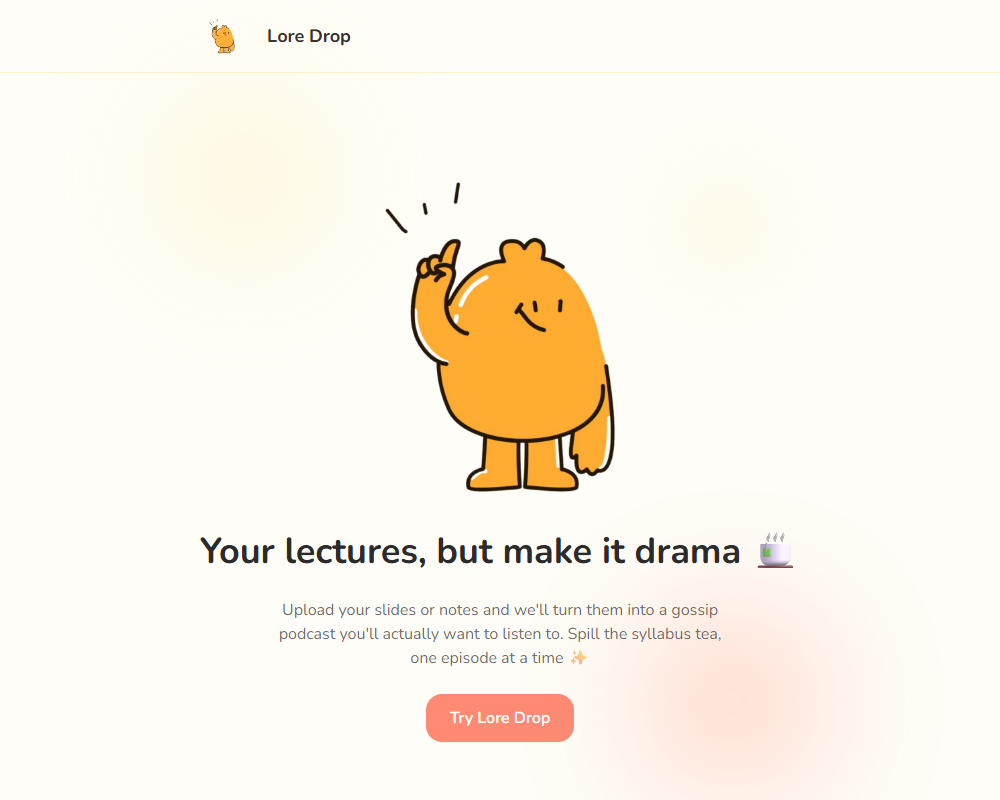
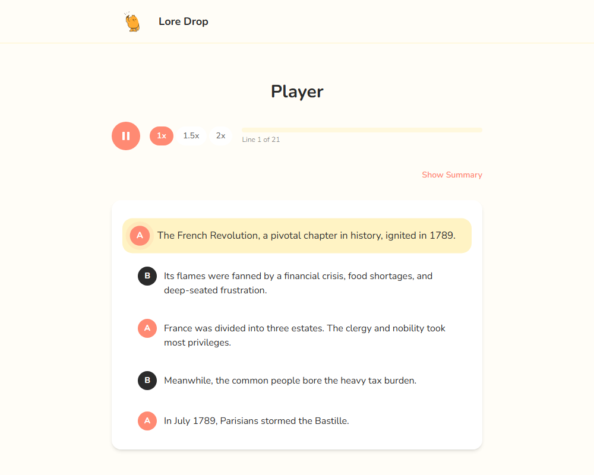
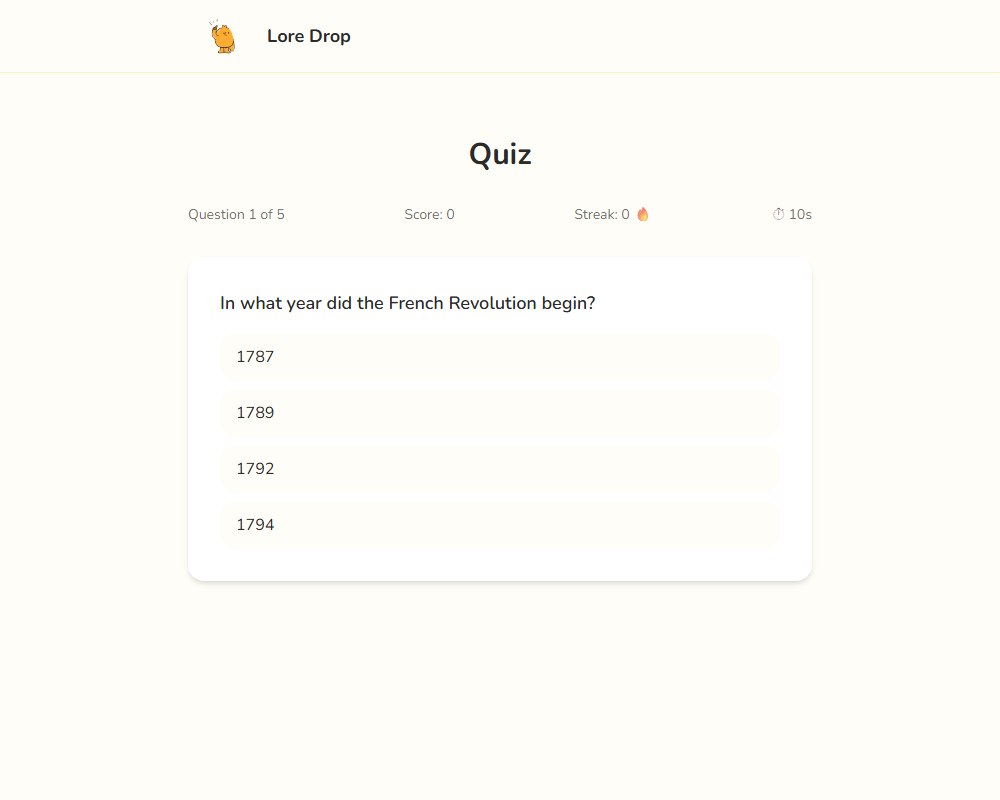

# Lore Drop 🎧

Turn your lecture slides, notes, or readings into a gossip podcast episode you'll actually want to listen to — then get quizzed on it before the tea has time to go cold.

## The problem

Nobody re-reads their lecture slides before an exam. Dense, dry source material is easy to skip and hard to retain. Lore Drop takes whatever you were supposed to study — a PDF, a slide deck, a Word doc, a photo of a whiteboard, or just pasted notes — and turns it into a short, genre-flavored two-host audio episode (gossip podcast, true crime, sports commentary, Gen-Z slang explainer, reality TV drama), dramatizing the *delivery* while keeping every fact intact. A webcam-based attention check gently roasts you if you drift off or start doom-scrolling mid-episode, and a lightning-round quiz plus session recap closes the loop on whether it actually stuck.

## How it works

1. **Upload** — drop in a PDF/PPTX/DOCX/image, or paste text directly.
2. **Pick a genre** — five tonally distinct styles to rewrite the material as a two-host dialogue.
3. **Listen** — a synced, karaoke-style transcript plays alongside real host audio, with adjustable speed and an on-demand AI summary.
4. **Stay honest** — an entirely client-side webcam check (nothing ever leaves your browser) notices if you wander off or start scrolling your phone, pauses the episode, and calls you out in-voice.
5. **Get quizzed** — a 5-question lightning round on the actual source material, then a recap card with your score, streak, focus time, and how many times you got caught slipping.

## Screenshots

| Landing | Player | Quiz |
|---|---|---|
|  |  |  |

## Tech stack

- **Frontend**: React + TypeScript, Vite, Tailwind CSS, React Router
- **Backend**: Node.js + Express (thin API layer, no database — everything is session-scoped in React context)
- **AI/ML**: [OpenAI](https://openai.com) (GPT-4o) for genre-dialogue rewriting, summaries, and quiz generation via Structured Outputs; [ElevenLabs](https://elevenlabs.io) for two-host text-to-speech; [MediaPipe Face Landmarker](https://ai.google.dev/edge/mediapipe/solutions/vision/face_landmarker) (on-device, in-browser) for the webcam attention check

### Sponsor tools used

- **OpenAI** — script/dialogue generation, AI summaries, and quiz question generation (all via Structured Outputs for reliable, parseable results)
- **ElevenLabs** — text-to-speech for both podcast hosts, including a small pre-generated library of "caught you" roast lines used by the attention-check feature

## Project structure

- `client/` — Vite + React + TypeScript + Tailwind CSS frontend
- `server/` — thin Express API server (`server/lib/` holds the actual OpenAI/ElevenLabs integration logic, `server/routes/` the HTTP layer, `server/scripts/` one-off content-generation scripts used during development)

## How to run locally

1. Install dependencies for both apps:

   ```
   npm run install:all
   ```

2. Set up backend environment variables:

   ```
   cp server/.env.example server/.env
   ```

   Then fill in `OPENAI_API_KEY` and `ELEVENLABS_API_KEY` in `server/.env`.

3. Start both dev servers concurrently:

   ```
   npm run dev
   ```

   - Frontend: http://localhost:5173
   - Backend health check: http://localhost:3001/api/health

### No API keys handy, or flaky wifi?

The Upload page has three "jump straight to a demo episode" links that load a fully pre-generated episode (script, audio, summary, and quiz) from a static file, with **zero** API calls — useful for a live demo if the network or an API is having a bad day.
